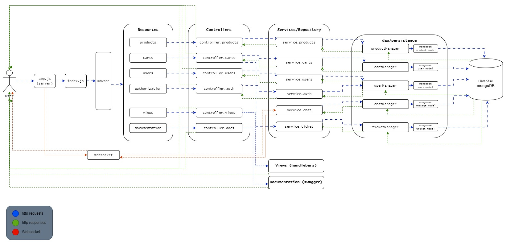
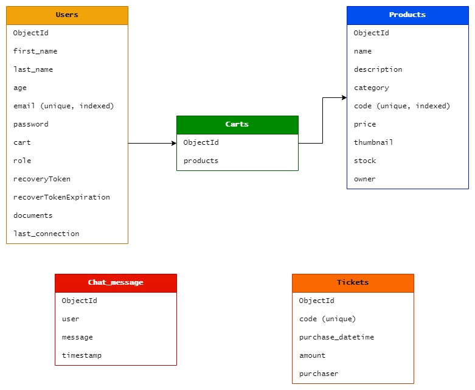

# :handbag:  CoderBackend e-commerce
<br/>
<br/>

## :floppy_disk: Versión actual

* 0.16.0 | (29/6/2023)

<br/>

## :eyes: Descripción

Backend de una aplicación e-commerce para ser presentada como proyecto final en el curso de Programación Backend de Coderhouse. El curso fue realizado de forma virtual entre diciembre de 2022 y junio de 2023.

El proyecto final consiste en la creación de una API REST con la que se pueden realizar todo tipo de funciones relacionadas a la creación, modificación y eliminación de productos; además de la gestión de carritos y la finalización de compras. Por otra parte, se podrán registrar usuarios con diferentes niveles de acceso y privilegios (usuario, premium y administrador), los cuales podrán comunicarse a través de un sistema de mensajería instantánea.

El servidor está basado en un diseño de capas bien definidas y para su funcionamiento se utilizaron patrones de diseño de uso frecuente, tales como Singleton, Repository, Factory, DTO, entre otros. Se utilizan file system y base de datos como modelos de persistencia, e incluye vistas de las principales funcionalidades creadas con un motor de plantillas.

El propósito de este repositorio y el de esta API, es educacional y de prueba. No se admite su uso de forma comercial.

<br/>

## :pencil:  Features

<b>Features de productos</b>

| Feature  |  Disponible   | Descripción  |
|----------|:-------------:|:-------------|
| Agregar un producto | &#10004; | Se puede agregar un producto al sistema. |
| Listar productos | &#10004; | Se pueden listar todos los productos o individualmente por su id. |
| Actualizar productos | &#10004; | Se pueden actualizar los productos ya creados. |
| Eliminar productos | &#10004; | Es posible eliminar un producto del sistema. |

<b>Features de carritos</b>

| Feature  |  Disponible   | Descripción  |
|----------|:-------------:|:-------------|
| Crear un carrito | &#10004; | Se puede crear carritos que almacenan productos. |
| Listar carritos | &#10004; | Se pueden listar todos los carritos o individualmente por su id. |
| Agregar producto | &#10004; | Se pueden agregar productos al carrito. En caso de que el producto ya exista, se agrega una unidad del mismo. |
| Actualizar productos | &#10004; | El contenido del carrito puede ser actualizado de forma completa. |
| Actualizar cantidad | &#10004; | Se puede modificar la cantidad de un producto contentido en el carrito. |
| Finalizar compra | &#10004; | Es posible realizar el proceso de compra total de los productos del carrito. |
| Eliminar producto | &#10004; | Es posible eliminar un producto del carrito. |
| Vaciar carrito | &#10004; | Es posible eliminar todos los items del carrito. |

<b>Features de usuarios</b>

| Feature  |  Disponible   | Descripción  |
|----------|:-------------:|:-------------|
| Registar usuario | &#10004; | Un usuario se puede registar en el sistema. |
| Listar usuarios | &#10004; | Un administrador puede listar a todos los usuarios. |
| Actualizar documentación | &#10004; | Un usuario puede subir documentación para ser validado como premium. |
| Cambiar rol | &#10004; | Un administrador puede cambiar el rol de un usuario entre regular y premium. |
| Eliminar usuarios | &#10004; | Un administrador puede eliminar un usuario del sistema. |
| Eliminar usuarios sin conexión | &#10004; | Un administrador puede eliminar del sistema a los usuarios que no se han conectado en un determinado tiempo. |

<br/>

## :book: Documentación

La API e-commerce Backend cuenta con una completa documentación realizada en Swagger. Se puede acceder a ella desde el navegador en la ruta '/apidocs'.

<br/>

## :wrench: Instalación

* Clone el repositorio [aquí](https://github.com/MarceloDutto/CoderBackend_ProyectoFinal.git).
* Para instalar todas las dependencias ejecute:
````
npm install
````
* Personalice las variables de entorno utilizando el .env.sample como referencia.

<br/>

## :desktop_computer: Ejecución

* Para ejecutar la aplicación en modo de desarrollo se debe correr el siguiente script:

````
npm run start:dev
````
* Luego conectarse a la API usando Postman al puerto 3000.

<br/>

## :file_folder: Arquitectura



<br/>

## :cd: Diseño de la base de datos



<br/>

## :new: Actualizaciones y commits

<b>Release v0.1.0 | 16/6/2023</b>

* Se realizó la configuración inicial del repositorio de GitHub y el repositorio local. 
* Se inició la aplicación y se levantó el servidor por primera vez.
* Se comenzó a confeccionar el readme del proyecto.

<b>Release v0.2.0 | 17/6/2023</b>

* Se instalaron *mongoose* y *dotenv* como dependencias. 
* Se conectó la aplicación a MongoDB, uitlizando el patrón Singleton para crear una única instancia de la conexión a la base de datos.
* Se agregó el archivo .env para guardar las variables de entorno, y se utilizó dotenv para el manejo de la configuración y de la informacion sensible.
* Actualización del readme.

<b>Release v0.3.0 | 17/6/2023</b>

* Se creó el enrutador para derivar las request del cliente a los respectivos controllers de cada recurso de la API. 
* Se realizaron pruebas de conexión a la API en Postman.
* Actualización del readme.

<b>Release v0.4.0 | 18/6/2023</b>

* Se trabajó en el modelo de persistencia de MongoDB. Se crearon los modelos de documentos de cada recurso para poder ser almacenados en la base de datos.
* Se crearon las clases correspondientes para manejar la funcionalidad de creación, obtención, actualización y eliminación de documentos.
* Se instaló *mongoose-paginate-v2* para manejar el filtrado y la paginación al obtener los productos de la base de datos.
* Actualización del readme.

<b>Release v0.5.0 | 20/6/2023</b>

* Se configuraron los endpoints necesarios para la interacción con el recurso de los productos en su controlador correspondiente. Ahora se puede crear, ver, actualizar y eliminar productos. La información será almacenada en el sistema de persistencia.
* Se instaló *multer* para cargar las imágenes correspondientes a los productos. 
* Se configuró el cargador de archivos para validar el tipo antes de realizar el guardado en la base de datos. Solo se admiten extensiones .jpg y .png.
* Se utilizó un DTO para retornar los datos de los productos, y así evitar la exposición de información sensible.
* Se desarrolló un sistema en el que los productos se retornan con opciones de límite de resultados, paginación, filtrado por categoría y ordenamiento ascendente o descendente por precio.
* Actualización del readme.

<b>Release v0.6.0 | 21/6/2023</b>

* Se instaló y se configuró *swagger* para compilar la documentación de la API.
* Se realizó la documentación detallada de los endpoints del recurso products.
* Actualización del readme.

<b>Release v0.7.0 | 22/6/2023</b>

* Se configuraron los endpoints para interactuar con el recurso de los carritos en su controlador correspondiente.
* Se realizó la documentación de esta funcionalidad en Swagger.
* Actualización del readme.

<b>Release v0.8.0 | 24/6/2023</b>

* Se configuraron los endpoints para interactuar con el recurso de usuarios en su controlador correspondiente.
* Se configuró *multer* para recibir archivos de imagen de perfil y documentación del usuario, limitando los tipos de archivo.
* Se instaló y se configuró *bcrypt* para hashear la contraseña en el registro del usuario, para que quede protegida en la base de datos y utilizarla en los siguientes inicios de sesión.
* Se utilizó un DTO para retornar los datos de los usuarios, y así evitar la exposición de información sensible.
* Se realizó la documentación de la API de usuarios en *swagger*.
* Actualización del readme.

<b>Release v0.9.0 | 24/6/2023</b>

* Se desarrolló el servicio de tickets para crear comprobantes de compra, que detallan la fecha y hora, los productos y su cantidad, el total del valor, y qué usuario está realizándola.
* Se instaló la librería *uuid* y se utilizó para generar el código único de cada ticket.
* Se modificó el servicio de carritos para emitir el ticket al finalizar la compra.
* Actualización del readme.

<b>Release v0.10.0 | 25/6/2023</b>

* Se configuró *passport* y *jwt* para manejar la autenticación de usuarios.
* Se realizó la lógica de autenticación por terceros con GitHub y Google.
* Actualización del readme.

<b>Release v0.11.0 | 26/6/2023</b>

- Se instaló el motor de plantillas *Handlebars* para el manejo de las vistas.
* Se realizaron las vistas de signup y login para realizar pruebas de autenticación en el navegador.
* Se completó la configuración del frontend con estilos *css* y scripts para manejo de formularios de registro y de inicio de sesión.
* Actualización del readme.

<b>Release v0.12.0 | 26/6/2023</b>

* Se instaló y se configuró nodemailer para gestionar el envío de correos electrónicos a los usuarios.
* Se configuró la funcionalidad de recuperación de contraseña con un token enviado por email.
* Se desarrollaron las vistas correspondientes en Handlebars.
* Actualización del readme.

<b>Release v0.13.0 | 26/6/2023</b>

* Se instaló CORS para eventualmente poder controlar las conexiones a la API.
* Se validaron todos los parámetros y los datos provenientes del body para evitar posibles errores y fallos de seguridad. Además se aplicaron pruebas de regex con el mismo fin.
* Actualización del readme.

<b>Release v0.14.0 | 28/6/2023</b>

* Se diseñó el resto de las vistas principales de la aplicación, tales como el listado de productos y la vista de sus detalles, la página de perfil, y el carrito para finalizar el proceso de compra.
* Se creó la vista del panel de administrador para modificar el rol de un usuario y/o eliminarlo.
* Actualización del readme.

<b>Release v0.15.0 | 29/6/2023</b>

* Se configuraron las politicas de acceso a los endpoints y las vistas.
* Se dio forma a la lógica de logout, con eliminación del token del navegador.
* Actualización del readme.

<b>Release v0.16.0 | 29/6/2023</b>

* Se implementó la biblioteca Socket.IO para establecer una conexión a través de un servidor de WebSocket.
* Se diseñó la interfaz del chat.
* Actualización del readme.