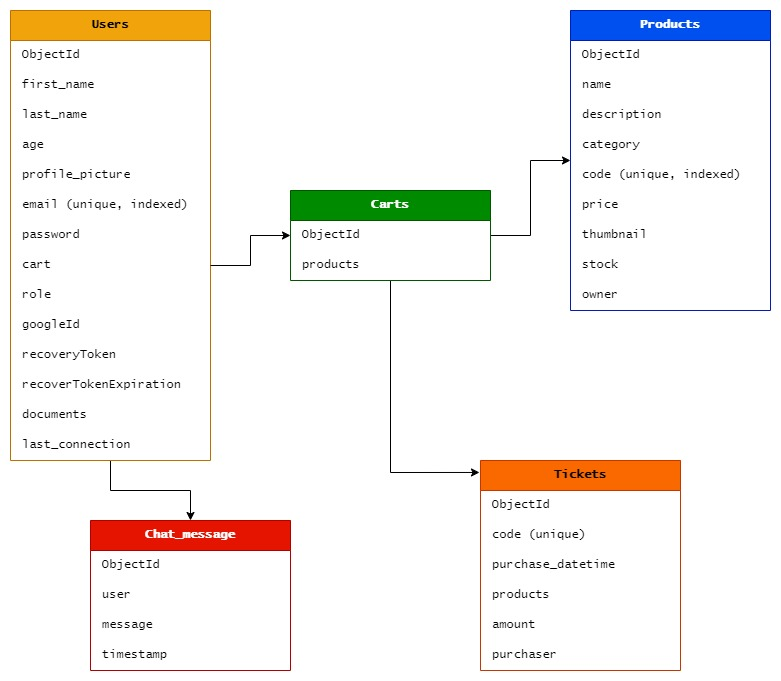

# :handbag:  CoderBackend e-commerce
<br/>
<br/>

## :floppy_disk: Versión actual

* 0.4.0 | (18/6/2023)

<br/>

## :eyes: Descripción

Backend de una aplicación e-commerce para ser presentada como proyecto final en el curso de Programación Backend de Coderhouse. El curso fue realizado de forma virtual entre diciembre de 2022 y junio de 2023.

El proyecto final consiste en la creación de una API REST con la que se pueden realizar todo tipo de funciones relacionadas a la creación, modificación y eliminación de productos; además de la gestión de carritos y la finalización de compras. Por otra parte, se podrán registrar usuarios con diferentes niveles de acceso y privilegios, los cuales podrán comunicarse a través de sistema de mensajería instantánea.

El servidor está basado en un diseño de capas bien definidas y para su funcionamiento se utilizaron patrones de diseño de uso frecuente, tales como Singleton, Repository, Factory, DTO, entre otros. Se utilizan file system y base de datos como modelos de persistencia, e incluye vistas de las principales funcionalidades creadas con un motor de plantillas.

<br/>

## :wrench: Instalación

* Clone el repositorio [aquí](https://github.com/MarceloDutto/CoderBackend_ProyectoFinal.git).
* Para instalar todas las dependencias ejecute:
````
npm install
````
* Personalice las variables de entorno utilizando el .env.sample como referencia.

<br/>

## :desktop_computer: Ejecución

* Para ejecutar la aplicación en modo de desarrollo se debe correr el siguiente script:

````
npm run start:dev
````
* Luego conectarse a la API usando Postman al puerto 3000.

<br/>

## :file_folder: Arquitectura


<br/>

## :cd: Diseño de la base de datos



<br/>

## :new: Actualizaciones y commits

<b>Release v0.1.0 | 16/6/2023</b>

* Se realizó la configuración inicial del repositorio de GitHub y el repositorio local. 
* Se inició la aplicación y se levantó el servidor por primera vez.
* Se comenzó a confeccionar el readme del proyecto.

<b>Release v0.2.0 | 17/6/2023</b>

* Se instalaron *mongoose* y *dotenv* como dependencias. 
* Se conectó la aplicación a MongoDB, uitlizando el patrón Singleton para crear una única instancia de la conexión a la base de datos.
* Se agregó el archivo .env para guardar las variables de entorno, y se utilizó dotenv para el manejo de la configuración y de la informacion sensible.
* Actualización del readme.

<b>Release v0.3.0 | 17/6/2023</b>

* Se creó el enrutador para derivar las request del cliente a los respectivos controllers de cada recurso de la API. 
* Se realizaron pruebas de conexión a la API en Postman.
* Actualización del readme.

<b>Release v0.4.0 | 18/6/2023</b>

* Se trabajó en el modelo de persistencia de MongoDB. Se crearon los modelos de documentos de cada recurso para poder ser almacenados en la base de datos.

* Se crearon las clases correspondientes para manejar la funcionalidad de creación, obtención, actualización y eliminación de documentos.

* Se instaló *mongoose-paginate-v2* para manejar el filtrado y la paginación al obtener los productos de la base de datos.